# MVP de Engenharia de Dados

## Objetivo

Neste trabalho, proponho a criação do ambiente de dados de um sistema de marketing de afiliados utilizando os dados da AWIN, uma plataforma que centraliza programas de afiliados de lojas online.

O objetivo final dessa plataforma, para o MVP, é fornecer dados de análise de perfis de lojas e produtos, permitindo ao analista responder de forma direta às seguintes perguntas:

* Quais categorias possuem produtos com a maior variação de preço (máximo - mínimo)?
* Quais categorias possuem produtos com a menor variação de preço (máximo - mínimo)?
* Quais categorias possuem produtos mais caros (considerando o preço médio dos produtos na categoria)?
* Quais categorias possuem produtos mais baratos (considerando o preço médio dos produtos na categoria)?
* Quais categorias possuem mais produtos classificados como "luxo" (preço acima do 9º decil)?
* Quais categorias possuem mais produtos classificados como "baratos" (preço abaixo da mediana)?
* Qual é a diferença média entre o display_price, mostrado ao cliente, e o search_price, usado para ranquear os produtos na busca? Essa diferença é a mesma para todas as categorias? Se não, quais categorias possuem as maiores e menores diferenças?
* Quais produtos estão nas categorias cheap, medium e lux?
* Baseado na média de preços, quais marcas (brands) estão nas categorias cheap, medium lux?
* Baseado na média de preços, quais vendedores (merchants) estão nas categorias cheap, medium lux?
* Baseado na média de preços, quais categorias estão nos segmentos cheap, medium, lux?
* Associando marcas e vendedores, eu gostaria de uma tabela que represente que o vendedor X fornece produtos de nível (cheap, medium, lux) da marca Y.?

Dessa forma, teremos perguntas que relacionam preços de produtos com categorias, marcas e vendedores, permitindo ao afiliado tomar decisões eficientes de recomendação de acordo com o seu público-alvo.


## Coleta e origem dos dados

Os dados foram recebidos dos feeds da AWIN, que disponibiliza arquivos em formato CSV contendo informações de produtos. Os feeds podem ser detalhados por vendedor (merchant) ou por categoria de produto, porém, o que temos são feeds que reunem os produtos de diversos vendedores que fornecem ítens no ramo de vestuário e moda, incluindo roupas, calçados e acessórios mas também ítens esportivos.

Foram feitos dois processos de carga dos dados:

* Inicialmente, os dados foram carregados diretamente do feed da AWIN pelas tasks executadas no Databricks, pelas suas URLs de download, porém, o processo de carregamento dessa forma tornava-o muito lento, sobretudo nas diferentetes retentativas, então, por mais que os jobs ainda tenham suporte ao carregamento via URL, hoje o processo é manual.

* O processo manual consiste em fazer download dos feeds, fazer upload para o unity catalog do Databricks, e então executar os jobs de ingestão a partir dos arquivos já disponíveis no ambiente do Databricks. Dessa forma, o tempo de carregamento foi bastante reduzido, e o processo de ingestão tornou-se mais estável (evitanto as quedas de conexão e timeouts que ocorriam no processo anterior, uma vez que o databricks impunha limites de tempo de conexão e downloads concorrentes). Não é o cenário ideial para produção, mas funciona bem para o MVP.

Foi feito o download dos seguintes feeds:

| table_name | feed_url |
|-----------|----------|
| common_fields | `https://productdata.awin.com/datafeed/download/apikey/<api-key>/language/pt/fid/44669,46605,47729,47753,50585,51837,51987,52631,53075,53089,53091,58413,58627,63901,75921,79509,91869,91942,93360,98680,109288/rid/0/hasEnhancedFeeds/0/columns/aw_deep_link,product_name,aw_product_id,merchant_product_id,merchant_image_url,description,merchant_category,search_price/format/csv/delimiter/%2C/compression/gzip/adultcontent/1/` |
| recommended | `https://productdata.awin.com/datafeed/download/apikey/<api-key>/language/pt/fid/44669,46605,47729,47753,50585,51837,51987,52631,53075,53089,53091,58413,58627,63901,75921,79509,91869,91942,93360,98680,109288/rid/0/hasEnhancedFeeds/0/columns/aw_deep_link,product_name,aw_product_id,merchant_product_id,merchant_image_url,description,merchant_category,search_price,merchant_name,merchant_id,category_name,category_id,aw_image_url,currency,store_price,delivery_cost,merchant_deep_link,language,last_updated,display_price,data_feed_id/format/csv/delimiter/%2C/compression/gzip/adultcontent/1/` |
| specification | `https://productdata.awin.com/datafeed/download/apikey/<api-key>/language/pt/fid/44669,46605,47729,47753,50585,51837,51987,52631,53075,53089,53091,58413,58627,63901,75921,79509,91869,91942,93360,98680,109288/rid/0/hasEnhancedFeeds/0/columns/aw_deep_link,product_name,aw_product_id,merchant_product_id,merchant_image_url,description,merchant_category,search_price,brand_name,brand_id,colour,product_short_description,specifications,condition,product_model,model_number,dimensions,keywords,promotional_text,product_type/format/csv/delimiter/%2C/compression/gzip/adultcontent/1/` |
| category_hierarchy | `https://productdata.awin.com/datafeed/download/apikey/<api-key>/language/pt/fid/44669,46605,47729,47753,50585,51837,51987,52631,53075,53089,53091,58413,58627,63901,75921,79509,91869,91942,93360,98680,109288/rid/0/hasEnhancedFeeds/0/columns/aw_deep_link,product_name,aw_product_id,merchant_product_id,merchant_image_url,description,merchant_category,search_price,commission_group,merchant_product_category_path,merchant_product_second_category,merchant_product_third_category/format/csv/delimiter/%2C/compression/gzip/adultcontent/1/` |
| product_prices | `https://productdata.awin.com/datafeed/download/apikey/<api-key>/language/pt/fid/44669,46605,47729,47753,50585,51837,51987,52631,53075,53089,53091,58413,58627,63901,75921,79509,91869,91942,93360,98680,109288/rid/0/hasEnhancedFeeds/0/columns/aw_deep_link,product_name,aw_product_id,merchant_product_id,merchant_image_url,description,merchant_category,search_price,rrp_price,saving,savings_percent,base_price,base_price_amount,base_price_text,product_price_old/format/csv/delimiter/%2C/compression/gzip/adultcontent/1/` |
| images | `https://productdata.awin.com/datafeed/download/apikey/<api-key>/language/pt/fid/44669,46605,47729,47753,50585,51837,51987,52631,53075,53089,53091,58413,58627,63901,75921,79509,91869,91942,93360,98680,109288/rid/0/hasEnhancedFeeds/0/columns/aw_deep_link,product_name,aw_product_id,merchant_product_id,merchant_image_url,description,merchant_category,search_price,merchant_thumb_url,large_image,alternate_image,aw_thumb_url,alternate_image_two,alternate_image_three,alternate_image_four/format/csv/delimiter/%2C/compression/gzip/adultcontent/1/` |
| ratings | `https://productdata.awin.com/datafeed/download/apikey/<api-key>/language/pt/fid/44669,46605,47729,47753,50585,51837,51987,52631,53075,53089,53091,58413,58627,63901,75921,79509,91869,91942,93360,98680,109288/rid/0/hasEnhancedFeeds/0/columns/aw_deep_link,product_name,aw_product_id,merchant_product_id,merchant_image_url,description,merchant_category,search_price,reviews,average_rating,rating,number_available/format/csv/delimiter/%2C/compression/gzip/adultcontent/1/` |
| product_identifiers | `https://productdata.awin.com/datafeed/download/apikey/<api-key>/language/pt/fid/44669,46605,47729,47753,50585,51837,51987,52631,53075,53089,53091,58413,58627,63901,75921,79509,91869,91942,93360,98680,109288/rid/0/hasEnhancedFeeds/0/columns/aw_deep_link,product_name,aw_product_id,merchant_product_id,merchant_image_url,description,merchant_category,search_price,ean,isbn,upc,mpn,parent_product_id,product_GTIN/format/csv/delimiter/%2C/compression/gzip/adultcontent/1/` |


Perceba que idendependentemente do feed carregado, todos eles possuem obrigatoriamente um conjunto de campos inicial padrão, que é o grupo **Defualt**, representado pela tabela `common_fields`. Esses campos são:

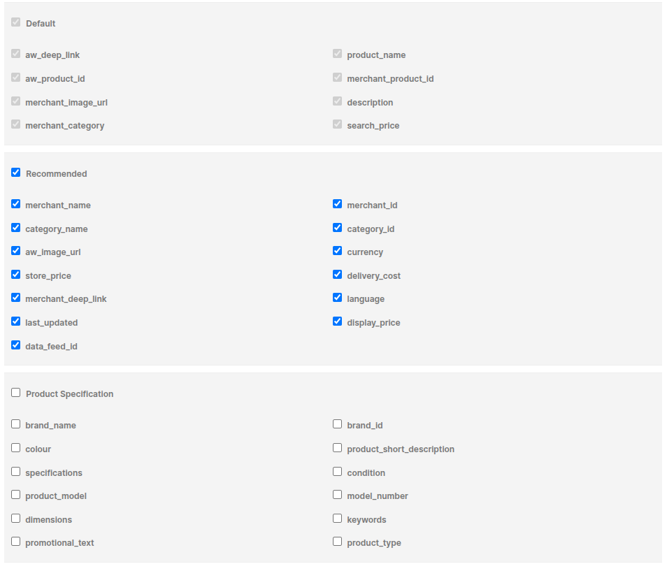

Ao longo da análise, vamos observar que muitos desses campos não são preenchidos, levando a um conjunto de dados problemático.

Com os dados manualmente no unity catalog do databricks, eles ficam disponíveis para acesso pelos jobs na pasta `/Volumes/workspace/awin_products/raw_data/awin_feed_data/`.

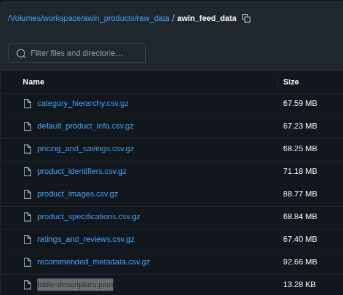

Podemos ver ali também a presença do arquivo [table-descriptors.json](metadata/table-descriptors.json), que documenta todas as tabelas, originalmente, documentava apenas as tabelas da camada bronze, mas por simplificadade passou a documentar todas. Considerando que as tabelas da camada silver têm as mesmas colunas das tabelas bronze, a documentação é válida para ambas as camadas (algumas colunas podem ser removidas na silver, mas as que permanecem tem a mesma documentação da bronze). Com ele, os processos de ingestão e ETL referenciam as tabelas e colunas de forma dinâmica, documentando no databricks automaticamente, centralizando como um único ponto de código para a documentação.


## Modelagem e Linhagem

Para a modelagem temos alguns aspectos a considerar. Na Bronze, não refletem um modelo em si, mas apenas a ingestão dos dados brutos do CSV na forma de tabelas, portanto, não me ocupei de construir um modelo para o mesmo, até por que o modelo na camada bronze seria similar ao modelo na camada Silver.


## Linhagem entre as camadas
A camada bronze foi montada diretamente dos arquivos de entrada. Não houve nenhuma mudança na estrutura dos dados, apenas a conversão do formato CSV para o formato Delta Lake e a inclusão dos comentários descrevendo as colunas, e a criação de tabelas particionadas por data de ingestão. Um ponto relevante é que há diversos arquivos, mas executei a ingestão apenas daqueles que são relevantes para o problema que busquei tratar.


As tabelas da camada Silver são montadas com transformação ETL direta de tabelas da camada bronze, uma tabela bronze fornece insumos para apenas uma tabela na camada silver, onde é feita uma limpeza dos dados como remoção de colunas desnecessários ou com dados faltantes, correção de tipos de dados ruins ou enriquecimento de dados (como é o caso da coluna `category`). 



Já a camada Gold, como uma camada pensada para problemas de negócio, é construída à partir de uma ou mais tabelnas na camada silver.

Algumas tabelas da Gold são geradas apenas por agregações na tabela `silver_feeds.default_product_info`.


Enquanto outras tabelas da Gold são geradas a partir de múltiplas tabelas da Silver.

A tabela `gold_price_analysis.brand_price_segmentation` é construída a partir das tabelas `silver_feeds.default_product_info`, que fornce informações de preço e `silver_feeds.product_specification` que fornece informações de marca.


A tabela `gold_price_analysis.merchant_price_segmentation` é construída a partir das tabelas `silver_feeds.default_product_info`, que fornce informações de preço e `silver_feeds.recommended_metadata` que fornece informações de vendedor (merchant).

E `gold_price_analysis.merchant_category_price_segmentation` é construída a partir das tabelas `silver_feeds.default_product_info`, que fornce informações de preço e categoria do vendedor.


Já `gold_price_analysis.merchant_brand_offering_segmentation` é construída à partir de três tabelas da Silver: `silver_feeds.default_product_info`, que fornece informações de preço, `silver_feeds.product_specification` que fornece informações de marca, e `silver_feeds.recommended_metadata` que fornece informações de vendedor (merchant).  


Já `gold_price_analysis.price_discrepancy_audit` é construída apenas a partir da tabela `silver_feeds.default_product_info`, que fornece o `search_price` e `silver_feeds.recommended_metadata` que fornece o `display_price`.  


## Modelo

A camada Gold foi desenhada com um modelo flat orientado ao problema de análise de preços, de forma que cada tabela na camada Gold responda a uma pergunta diretamente. Assim sendo, adotamos *Flat Tables* setorizados, o que corresponde a Data Marts. Dessa forma, toda a complexidade para responder às perguntas de negócio fica concentrada no ETL que gera essas tabelas, simplificando enormemente as consultas. Não há chaves estrangeiras neste modelo, e as tabelas são otimizadas para leitura com pequenos filtros e sem necessidade de joins.

Na camada silver, eu busquei adotar um modelo normalizado híbrido, próximo à 3FN, que mesmo tendo poucas tabelas, seria um *Snowflake*. As tabelas são separadas por domínios, removendo colunas redundantes, dessa forma, `default_product_info`, que na bronze possui dados que são repetidos em todas as tabelas, aqui se torna o foco central para contendo a chave primária para acessar produtos. A informação redundante foi removida das outras tabelas, tornando-as focadas em responsabilidade:

* Dados centrais do produto $\rightarrow$ default_product_info
* Dados técnicos/físicos $\rightarrow$ product_specifications
* Dados de venda/loja $\rightarrow$ recommended_metadata

A nomenclatura das tabelas poderia refletir melhor seu objetivo de negócio, mas preferi ser um pouco mais fiel ao fornecido pela AWIN para facilitar o entendimento do mapeamento dos dados e facilitar a susceptibilidade a mudanças futuras na estrutura dos dados fornecidos pela AWIN tornando meu sistema mais conformista.

à seguir, apresento o modelo de dados entre as camadas Silver e Bronze, incluí apenas os campos mais importantes para facilitar a visualização, os campos detalhados podem ser vistos na documentação geral das tabelas.


## Carga e análise

O carregamento dos dados na camada Bronze foi feito de forma imediata por meio do job [`ingest_to_bronze.py`](mvp/src/mvp/transformations/ingest_to_bronze.py). Esse job lê os aquivos CSV disponibilizados no unity catalog ou via URL, convert para o formato Delta Lake do Databricks e adiciona comentários às colunas.

### Job de Ingestão de Dados: ingest_to_bronze.py

**Parâmetros de Entrada:**
- `--source-feed-url`: URL ou caminho local para os dados CSV compactados do feed (env: SOURCE_PATH)
- `--remove-all-null-columns`: Flag booleano para remover colunas completamente nulas dos dados processados (env: REMOVE_ALL_NULL_COLUMNS, padrão: True)
- `--metadata-path`: Caminho para arquivo JSON de metadados contendo documentação de tabelas e colunas (env: METADATA_PATH)
- `--write-mode`: Modo de escrita do Spark, "overwrite" ou "append" (env: WRITE_MODE)
- `--catalog`: Nome do catálogo de destino para tabela de saída (env: CATALOG)
- `--schema`: Nome do schema de destino para tabela de saída (env: SCHEMA)
- `--table`: Nome da tabela de destino para saída (env: TABLE)

**Saídas:**
- Tabela Delta Lake criada em `{catalog}.{schema}.{table}` com dados CSV processados
- Comentários e documentação de colunas aplicados automaticamente do JSON de metadados
- Tipos de dados convertidos conforme definições do schema do arquivo de metadados
- Estrutura de tabela otimizada com colunas nulas removidas (se habilitado)


Todos os arquivos foram carregados por este mesmo código, só sendo necessário alterar os parâmetros de entrada para cada tabela/arquivo.

Vou passar rapidamente pelo código deste job para que fique claro o que foi feito.

```python
@click.command()
@click.option("--source-feed-url", type=click.STRING, envvar="SOURCE_PATH", help="The Feed url")
@click.option("--remove-all-null-columns/--keep-all-null-columns", envvar="REMOVE_ALL_NULL_COLUMNS", type=click.BOOL,
              default=True,
              help="Should remove all null columns")
@click.option("--metadata-path", type=click.STRING, envvar="METADATA_PATH", help="Path to the JSON metadata file")
@click.option("--write-mode", type=click.Choice(["overwrite", "append"]), envvar="WRITE_MODE", help="Spark write mode")
@click.option("--catalog", type=click.STRING, envvar="CATALOG", help="The output catalog name")
@click.option("--schema", type=click.STRING, envvar="SCHEMA", help="The output schema name")
@click.option("--table", type=click.STRING, envvar="TABLE", help="The output table name")
def main(source_feed_url: str, remove_all_null_columns: bool, metadata_path: str, write_mode: str, catalog: str, schema: str, table: str):
    schema_metadata = load_table_schema(metadata_path, table)
    raw_dataframe = load_raw_gzip_csv(source_feed_url, remove_all_null_columns)
    raw_dataframe = cast_columns_from_schema(raw_dataframe, schema_metadata)
        
    save_dataframe_with_metadata(raw_dataframe, catalog, schema, table, write_mode, schema_metadata)   

    return True
```

A função `load_table_schema` carrega o schema do arquivo JSON de metadados, retornando um dicionário com as definições de colunas e tipos.

A função `load_raw_gzip_csv` lê o arquivo CSV compactado em gzip, retornando um DataFrame do Spark. Se o parâmetro `remove_all_null_columns` for verdadeiro, colunas que são completamente nulas são removidas do DataFrame. Ela sabe como lidar com arquivos originados do delta lake ou de uma URL de forma transparente.

A função `cast_columns_from_schema` converte os dados para o schema definido no arquivo json de metados, limitando os tipos entre TEXT, BIGINT e DECIMAL, o que torna mais simples as etapas seguintes evitando tipos mistos.

Por fim `save_dataframe_with_metadata` salva o DataFrame no formato Delta Lake, aplicando os comentários e documentação de colunas conforme o arquivo de metadados. Ele cria a tabela `table` se não existir, se existir, remove e recria. 


### ETLs para silver

Após a carga na Bronze, os dados foram analisados para que fossem devidamente limpos e pudessemos gerar a camada silver com dados de qualidade. As análises foram feitas em notebooks que se encontram na pasta [`analysis`](mvp/src/mvp/analysis/), os notebooks não estão mostrando os gráficos corretamente e algumas tabelas estão muito grandes quando apresentadas no github, mesmo limitando a saída. Portanto, estou disponibiliando os mesmos em arquivos HTML na pasta [report/analysis/](report/analysis/), perceba que alguns são grandes demais para serem lidos diretamente do github e o que é exibido é o código HTML, então recomendo baixar os arquivos HTML ou clonar o repositório e abrir os arquivos localmente no navegador para uma melhor experiência de leitura.

Não vou entrar em detalhes das análises aqui, uma vez que está disponível nos arquivos HTML, mas de forma geral, observei os seguintes pontos:

* Colunas irrelevantes para o nosso problema podem ser removidas
* Colunas da tabela `default_product_info` que se repetem podem ser removidas das demais tabelas, exceto as chaves estrangeiras.
* Colunas com valores nulos podem ser removidas.
* Colunas precisam ser convertidas para os tipos certos, no caso, preços precisam ser numéricos.
* Algumas colunas precisam de enriquecimento, como a coluna `category`, que pode ser construída a partir da coluna `merchant_category` da tabela `category_hierarchy`.

Aplicando essa análise a todas as tabelas da camada bronze, consegui definir a função de transformação de cada tabela para a silver, com suas particularidades, de modo geral, o formato do job de transformação é o mesmo:

### Job de Transformação ETL (Bronze para Silver)

**Parâmetros de Entrada:**
- `--metadata-path`: Caminho para arquivo JSON de metadados contendo documentação de tabelas e colunas (env: METADATA_PATH)
- `--write-mode`: Modo de escrita do Spark, "overwrite" ou "append" (env: WRITE_MODE)
- `--catalog`: Nome do catálogo onde as tabelas estão localizadas (env: CATALOG)
- `--bronze-schema`: Nome do schema da tabela de origem na camada bronze (env: BRONZE_SCHEMA)
- `--bronze-table`: Nome da tabela de origem na camada bronze (env: BRONZE_TABLE)
- `--silver-schema`: Nome do schema de destino para tabela na camada silver (env: SILVER_SCHEMA)
- `--silver-table`: Nome da tabela de destino na camada silver (env: SILVER_TABLE)

**Saídas:**
- Tabela Delta Lake criada em `{catalog}.{silver-schema}.{silver-table}` com dados transformados e limpos
- Comentários e documentação de colunas aplicados automaticamente do JSON de metadados
- Tipos de dados corrigidos e otimizados conforme análise de qualidade
- Colunas irrelevantes ou com excesso de nulos removidas
- Dados enriquecidos com novas colunas derivadas quando necessário

**Fluxo de Processamento:**
1. Carrega metadados da tabela silver alvo
2. Lê dados da tabela bronze de origem
3. Aplica transformações de limpeza e enriquecimento através da função `_transform()`
4. Salva resultado na tabela silver com documentação e metadados

```python
@click.command()
@click.option("--metadata-path", type=click.STRING, envvar="METADATA_PATH", help="Path to the JSON metadata file")
@click.option("--write-mode", type=click.Choice(["overwrite", "append"]), envvar="WRITE_MODE", help="Spark write mode")
@click.option("--catalog", type=click.STRING, envvar="CATALOG", help="The catalog name")
@click.option("--bronze-schema", type=click.STRING, envvar="BRONZE_SCHEMA", help="The source bronze schema name")
@click.option("--bronze-table", type=click.STRING, envvar="BRONZE_TABLE", help="The source bronze table name")
@click.option("--silver-schema", type=click.STRING, envvar="SILVER_SCHEMA", help="The output silver schema name")
@click.option("--silver-table", type=click.STRING, envvar="SILVER_TABLE", help="The source silver table name")
def main(metadata_path: str, write_mode: str, catalog: str, bronze_schema: str, bronze_table: str, silver_schema: str, silver_table: str):
    schema_metadata = load_table_schema(metadata_path, silver_table)
    bronze_dataframe = load_data_frame_from_table(catalog, bronze_schema, bronze_table)
    
    silver_dataframe = _transform(bronze_dataframe)
            
    save_dataframe_with_metadata(silver_dataframe, catalog, silver_schema, silver_table, write_mode, schema_metadata)
```

As funções `load_table_schema` e `save_dataframe_with_metadata` são as mesmas usadas em `ingest_to_bronze.py`, a diferença aqui está na função `load_data_frame_from_table` que tem como objetivo carregar dados da tabela indicada pelos seus argumentos e devolver um `DataFrame`, e na função privada `_transform()`, que é onde estão as transformações específicas para cada tabela. A função `_transform` é especifica de cada job de transformação, vamos discutir cada uma delas de forma separada com as tabelas às quais se referem.

#### Transformação para tabela `default_product_info_silver`

Na análise concluí que que as colunas relevantes para o problema são apenas aquelas exibidas em `kept_columns`, elas incluem também o deep_link que ue usaria para extrair informações do produto via web scrapping, mas decidi por abandonar a ideia.

Na análise, vi que alguns registros possuíam `merchant_category` não nulo porém `merchant_image_url` nulo, e que isso se devia a um erro de formatação no arquivo de feeds (que é um CSV), fazendo com que estes campos estivessem corrompidos, assim, decidi remover esses registros.

Eu removi a coluna `merchant_category` e criei a coluna `category`, que extrai a última parte da hierarquia de categorias presente em `merchant_category`, removendo espaços em branco e convertendo para minúsculas.

A análise completa, tal como os resultados intermediários que me guiaram na tomada de decisão podem ser encontrados no arquivo HTML [default_product_info-analysis.html](report/analysis/default_product_info-analysis.html), que contém as informações desta análise na forma de um notebook exportado.

Com a transformação de category foi possível reunir muitos registros espalhados, mas ainda não é suficiente, pois diferentes merchants geram categorias diferentes, e a categoria na AWIN não é preenchida. Seria necessário um esforço muito maior para padronizar esses dados.

na imagem seguinte, podemos ver a esquerda a nova categoria e à direita a categoria original do merchant, claro, é apenas um exemplo, pois temos centenas de categorias na base.

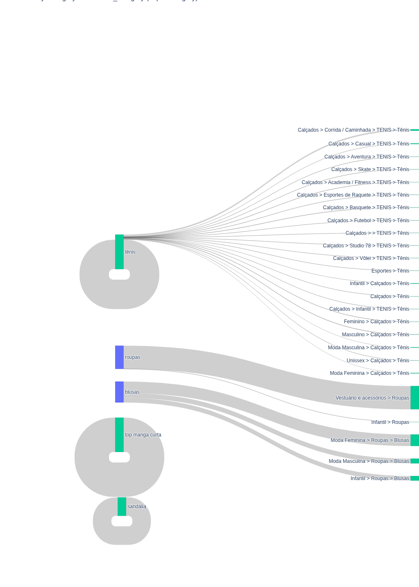

```python
def _transform(bronze_dataframe: DataFrame) -> DataFrame:
    filter_expression  = F.col("merchant_category").isNotNull() & F.col("merchant_image_url").isNotNull()
    silver_dataframe = bronze_dataframe.where(filter_expression)
    
    category = F.split_part(F.col("merchant_category"), F.lit(">"), F.lit(-1))
    silver_dataframe = silver_dataframe.withColumn("category", F.lower(F.trim(category)))

    kept_columns = [
        "aw_product_id",
        "merchant_product_id",
        "category",

        "product_name",    
        "description",
            
        "aw_deep_link",
        "search_price"
    ]

    silver_dataframe = silver_dataframe.select(*kept_columns)

    return silver_dataframe
```

#### Transformação para tabela `recommended_metadata_silver`

Aqui eu decidi que essa tabela seria responsável por informações de vendedor/loja (merchant). O mais importante aqui foi a conversão do display price, que se apreentava como uma string no formato `BRL123.45`, para um valor numérico do tipo double. Para tanto, removi o prefixo `BRL` e converti o restante para double. Registros que após a conversão permaneceram com com display_price nulo foram removidos, pois a análise revelou que estes já estavam mal formatados no arquivo de feed.

Outra decisão relevante revelada pela análise, foi a remoção da coluna currency, que é sempre `BRL` em todos os registros, o que a torna redundante, assim, não foi selecionada.

Os detalhes da análise podem ser encontrados no notebook exportado em HTML no aequivo [recommended_metadata-analysis.html](report/analysis/recommended_metadata-analysis.html).

```python
def _transform(bronze_dataframe: DataFrame) -> DataFrame:
    columns_to_keep = [
        "aw_product_id",
        "merchant_product_id",

        "data_feed_id",
        "merchant_id",
        
        "merchant_name",
            
        "aw_image_url",
        "merchant_deep_link",

        "display_price",
    ]

    silver_dataframe = bronze_dataframe\
        .withColumn("display_price", F.replace(F.col("display_price"), F.lit("BRL"), F.lit("")).try_cast("double"))\
        .where(F.col("display_price").isNotNull())\
        .select(*columns_to_keep)
    
    return silver_dataframe
```

#### Transformação para tabela `product_specification_silver`

Aqui, todos os campos são categoricos, além de colunas com muitos valores nulos, problema comum em todas as tabelas, houve um valor para condition `99.9` que identifiquei na análise ser consequência de uma linha mal formatada no feed, assim, mantive apenas aquelas linhas que possuiam condition `new`, `used`, ou nulo.

Outra etapa foi a normalização dos valores de `brand_name`, `colour` e `condition`, removendo espaços em branco e convertendo para minúsculas, para permitir uma agregação melhor em caso de diferenças de escrita.

Os detalhes podem ser encontrados no arquivo [product_specifications-analysis.html](report/analysis/product_specifications-analysis.html).

```python
def _transform(bronze_dataframe: DataFrame) -> DataFrame:
    columns_to_keep = [
        "aw_product_id",
        "merchant_product_id",

        "brand_name",
        "colour",
        
        "condition"
    ]

    silver_dataframe = bronze_dataframe.select(*columns_to_keep)

    silver_dataframe = silver_dataframe\
        .where(F.col("condition").isNull() | (F.lower(F.col("condition")) == F.lit("new")) | (F.lower(F.col("condition")) == F.lit("used")))\
        .withColumn("brand_name", F.trim(F.lower(F.col("brand_name"))))\
        .withColumn("colour", F.trim(F.lower(F.col("colour"))))\
        .withColumn("condition", F.trim(F.lower(F.col("condition"))))

    return silver_dataframe
```

### Transformações para Gold e questões de negócio

Como ja discutido anteriormente, as tabelas na camada Gold tem como objetivo direto responder à questões de negócio. Portanto, vou apresentar as questõoes que serão respondidas por cada tabela e isso justificará a transformação realizada.

Primeiramente, para facilitar, eu criei uma função comum que calcula as estatísticas da `default_product_info` essas estatísticas são usadas para definir os quantis (`p90` e `mediana`) em cima do `search_price`.


#### Tabela `brand_price_segmentation`

Pergunta:
* Baseado na média de preços, quais marcas (brands) estão nas categorias cheap, medium lux?

O que nos levou a gerar a tabela da forma: Para responder a esta pergunta, a tabela Gold precisa pré-agregar os dados por marca. O ETL calcula a média de preço de todos os produtos de cada marca (AVG) e compara esse valor com as estatísticas globais (Mediana e P90). Isso "carimba" a marca com uma classificação de negócio (Cheap/Medium/Lux) diretamente na tabela, evitando cálculos complexos durante a consulta final.

```python
def _transform(silver_catalog: str, silver_schema: str) -> DataFrame:
    """
    Classifies Brands based on the average price of their product portfolio.
    """
    global_median, global_p90 = get_global_price_statistics(spark, silver_catalog, silver_schema)
    
    sql = f"""
    SELECT
        s.brand_name,
        COUNT(i.aw_product_id) AS total_products,
        AVG(i.search_price) AS average_brand_price,
        CASE
            WHEN AVG(i.search_price) < {global_median} THEN 'Cheap'
            WHEN AVG(i.search_price) > {global_p90} THEN 'Lux'
            ELSE 'Medium'
        END AS brand_segment
    FROM
        {silver_catalog}.{silver_schema}.default_product_info i
    JOIN
        {silver_catalog}.{silver_schema}.product_specifications s ON i.aw_product_id = s.aw_product_id
    WHERE
        i.search_price IS NOT NULL AND s.brand_name IS NOT NULL
    GROUP BY
        s.brand_name
    """
    gold_dataframe = spark.sql(sql)
    
    return gold_dataframe
```

#### Tabela `category_price_classification`

Perguntas:

* Quais categorias possuem mais produtos classificados como "luxo" (preço acima do 9º decil)?
* Quais categorias possuem mais produtos classificados como "baratos" (preço abaixo da mediana)?

O que nos levou a gerar a tabela da forma: Em vez de classificar produto por produto em tempo de execução, o ETL realiza a contagem condicional (COUNT CASE WHEN...) baseada nos percentis globais. A tabela resultante contém colunas prontas (lux_count, cheap_count, lux_percentage) para cada categoria. Isso permite responder às perguntas com uma ordenação simples (ORDER BY), sem necessidade de recalcular medianas ou percentis.

```python
def _transform(silver_catalog: str, silver_schema: str) -> DataFrame:
    """
    Transformation logic for category_price_classification table.
    Calculates Cheap/Medium/Lux percentages based on global statistics.
    """
    
    # Cálculo das estatísticas globais para uso na query principal
    # Em tasks ETL, é mais seguro fazer isso separado para garantir que o spark capture os valores escalares
    stats_query = f"""
    SELECT
        percentile_approx(search_price, 0.5) AS global_median,
        percentile_approx(search_price, 0.9) AS global_p90
    FROM {silver_catalog}.{silver_schema}.default_product_info
    WHERE search_price IS NOT NULL
    """
    
    # Coletamos os valores para injetar na query principal (evita cross join complexo em datasets gigantes)
    stats_row = spark.sql(stats_query).collect()[0]
    global_median = stats_row['global_median']
    global_p90 = stats_row['global_p90']

    sql = f"""
    SELECT
        category,
        COUNT(*) AS total_products,
        
        -- Counts
        COUNT(CASE WHEN search_price > {global_p90} THEN 1 END) AS lux_count,
        COUNT(CASE WHEN search_price >= {global_median} AND search_price <= {global_p90} THEN 1 END) AS medium_count,
        COUNT(CASE WHEN search_price < {global_median} THEN 1 END) AS cheap_count,
        
        -- Percentages
        (COUNT(CASE WHEN search_price > {global_p90} THEN 1 END) / COUNT(*)) * 100 AS lux_percentage,
        (COUNT(CASE WHEN search_price >= {global_median} AND search_price <= {global_p90} THEN 1 END) / COUNT(*)) * 100 AS medium_percentage,
        (COUNT(CASE WHEN search_price < {global_median} THEN 1 END) / COUNT(*)) * 100 AS cheap_percentage
        
    FROM
        {silver_catalog}.{silver_schema}.default_product_info
    WHERE
        search_price IS NOT NULL
    GROUP BY
        category
    """
    
    gold_dataframe = spark.sql(sql)
           
    return gold_dataframe
```

#### Tabela category_price_variability

Perguntas:

* Quais categorias possuem produtos com a maior variação de preço (máximo - mínimo)?
* Quais categorias possuem produtos com a menor variação de preço?

O que nos levou a gerar a tabela da forma: O ETL pré-calcula a amplitude (price_amplitude = MAX - MIN) e mantém a contagem de produtos (product_count). Isso é fundamental para filtrar outliers (categorias com poucos produtos que distorcem a análise).

```python
def _transform(silver_catalog: str, silver_schema: str) -> DataFrame:
    """
    Transformation logic for category_price_variability table.
    """

    sql = f"""
    SELECT
        category,
        COUNT(aw_product_id) AS product_count,
        MIN(search_price) AS minimum_price,
        MAX(search_price) AS maximum_price,
        (MAX(search_price) - MIN(search_price)) AS price_amplitude
    FROM
        {silver_catalog}.{silver_schema}.default_product_info
    WHERE
        search_price IS NOT NULL
    GROUP BY
        category
    """
    
    gold_dataframe = spark.sql(sql)
                   
    return gold_dataframe
```

#### Tabela `merchant_brand_offering_segmentation`

Pergunta:
* Associando marcas e vendedores, eu gostaria de uma tabela que represente que o vendedor X fornece produtos de nível (cheap, medium, lux) da marca Y.

O que nos levou a gerar a tabela da forma: Esta tabela resolve a complexidade de junção "Vendedor" + "Marca" + "Preço". O ETL cruza as três tabelas Silver necessárias e calcula o posicionamento de preço especificamente para esse par (Vendedor/Marca). A tabela resultante é a resposta direta à pergunta, servindo como um catálogo analítico de ofertas.

```python
def _transform(silver_catalog: str, silver_schema: str) -> DataFrame:
    """
    Associates Merchants and Brands to show the price positioning of a specific brand sold by a specific merchant.
    """
    global_median, global_p90 = get_global_price_statistics(spark, silver_catalog, silver_schema)
    
    sql = f"""
    SELECT
        m.merchant_name,
        s.brand_name,
        COUNT(i.aw_product_id) AS products_offered,
        AVG(i.search_price) AS average_offering_price,
        CASE
            WHEN AVG(i.search_price) < {global_median} THEN 'Cheap'
            WHEN AVG(i.search_price) > {global_p90} THEN 'Lux'
            ELSE 'Medium'
        END AS offering_segment
    FROM
        {silver_catalog}.{silver_schema}.default_product_info i
    JOIN
        {silver_catalog}.{silver_schema}.recommended_metadata m ON i.aw_product_id = m.aw_product_id
    JOIN
        {silver_catalog}.{silver_schema}.product_specifications s ON i.aw_product_id = s.aw_product_id
    WHERE
        i.search_price IS NOT NULL AND s.brand_name IS NOT NULL
    GROUP BY
        m.merchant_name, s.brand_name
    """
    gold_dataframe = spark.sql(sql)
    
    gold_dataframe = gold_dataframe.withMetadata("offering_segment", {"comment": "Price tier of the specific brand when sold by this specific merchant"})
    return gold_dataframe
```


#### Tabela `merchant_category_segmentation`

Pergunta:
* Baseado na média de preços, quais categorias de vendedores (merchants) estão nas categorias cheap, medium lux?
* Quais categorias possuem produtos mais caros/baratos?

O que nos levou a gerar a tabela da forma: O ETL agrupa os dados por Categoria e calcula o preço médio (average_category_price). Para a pergunta "Quais categorias estão em Cheap/Medium/Lux", o ETL já cria a coluna category_segment. Para as perguntas cruzadas (variação vs preço médio), esta tabela fornece a métrica de média que não existe na tabela de variabilidade.


```python
def _transform(silver_catalog: str, silver_schema: str) -> DataFrame:
    """
    Classifies 'Categories' (categories defined by the seller, not Awin) based on average price.
    """
    global_median, global_p90 = get_global_price_statistics(spark, silver_catalog, silver_schema)
    
    sql = f"""
    SELECT
        category,
        COUNT(aw_product_id) AS total_products,
        AVG(search_price) AS average_category_price,
        CASE
            WHEN AVG(search_price) < {global_median} THEN 'Cheap'
            WHEN AVG(search_price) > {global_p90} THEN 'Lux'
            ELSE 'Medium'
        END AS category_segment
    FROM
        {silver_catalog}.{silver_schema}.default_product_info
    WHERE
        search_price IS NOT NULL AND category IS NOT NULL
    GROUP BY
        category
    """
    df = spark.sql(sql)
    
    return df
```


#### Tabela `merchant_price_segmentation`

Pergunta:
* Baseado na média de preços, quais vendedores (merchants) estão nas categorias cheap, medium lux?

O que nos levou a gerar a tabela da forma: Similar à segmentação de marca, esta tabela agrega todo o portfólio de um vendedor para determinar seu "posicionamento de mercado". O ETL calcula a média de todos os produtos do vendedor e atribui o segmento.

```python
def _transform(silver_catalog: str, silver_schema: str) -> DataFrame:
    """
    Classifies Merchants based on the average price of the products they sell.
    """
    global_median, global_p90 = get_global_price_statistics(spark, silver_catalog, silver_schema)
    
    sql = f"""
    SELECT
        m.merchant_name,
        m.merchant_id,
        COUNT(i.aw_product_id) AS total_products,
        AVG(i.search_price) AS average_merchant_price,
        CASE
            WHEN AVG(i.search_price) < {global_median} THEN 'Cheap'
            WHEN AVG(i.search_price) > {global_p90} THEN 'Lux'
            ELSE 'Medium'
        END AS merchant_segment
    FROM
        {silver_catalog}.{silver_schema}.default_product_info i
    JOIN
        {silver_catalog}.{silver_schema}.recommended_metadata m ON i.aw_product_id = m.aw_product_id
    WHERE
        i.search_price IS NOT NULL
    GROUP BY
        m.merchant_name, m.merchant_id
    """
    gold_dataframe = spark.sql(sql)
    
    return gold_dataframe
```

#### Tabela `price_discrepancy_audit`

Pergunta:
* Qual é a diferença média entre o display_price, mostrado ao cliente, e o search_price, usado para ranquear os produtos na busca? Essa diferença é a mesma para todas as categorias? Se não, quais categorias possuem as maiores e menores diferenças?

O que nos levou a gerar a tabela da forma: Esta é uma tabela de qualidade de dados e auditoria. O ETL realiza o cálculo matemático (meta.display_price - info.search_price) linha a linha e agrega por categoria. Isso permite identificar rapidamente problemas sistemáticos de precificação em determinadas categorias sem precisar processar milhões de linhas de produtos brutos.


```python
def _transform(silver_catalog: str, silver_schema: str) -> DataFrame:
    """
    Transformation logic for price_discrepancy_audit table.
    """
    sql = f"""
    SELECT
        info.category,
        AVG(meta.display_price - info.search_price) AS average_price_difference,
        MIN(meta.display_price - info.search_price) AS min_difference,
        MAX(meta.display_price - info.search_price) AS max_difference,
        
        COUNT(CASE WHEN (meta.display_price - info.search_price) <> 0 THEN 1 END) AS count_with_discrepancy,
        COUNT(*) AS total_checked_products
        
    FROM
        {silver_catalog}.{silver_schema}.default_product_info info
    INNER JOIN
        {silver_catalog}.{silver_schema}.recommended_metadata meta
        ON info.aw_product_id = meta.aw_product_id
    WHERE
        info.search_price IS NOT NULL AND meta.display_price IS NOT NULL
    GROUP BY
        info.category
    """
    
    gold_dataframe = spark.sql(sql)
    
    gold_dataframe = gold_dataframe.withMetadata("average_price_difference", {"comment": "Average difference between display price and search price"}) \
           .withMetadata("count_with_discrepancy", {"comment": "Number of products where prices do not match"})
           
    return gold_dataframe
```


#### Tabela `product_price_segmentation`

Pergunta:
* Quais produtos estão nas categorias cheap, medium e lux?

O que nos levou a gerar a tabela da forma: Esta é a tabela mais granular da camada Gold. Ela mantém o nível do produto (aw_product_id) mas adiciona valor ao pré-calcular a coluna price_segment. Isso permite que o usuário filtre produtos por faixa de preço "psicológica" (Barato/Caro) em vez de filtrar por valores numéricos brutos.

```python
def _transform(silver_catalog: str, silver_schema: str) -> DataFrame:
    """
    Classifies every individual product into Cheap, Medium, or Lux based on global thresholds.
    """
    global_median, global_p90 = get_global_price_statistics(spark, silver_catalog, silver_schema)
    
    sql = f"""
    SELECT
        aw_product_id,
        product_name,
        category,
        search_price,
        CASE
            WHEN search_price < {global_median} THEN 'Cheap'
            WHEN search_price > {global_p90} THEN 'Lux'
            ELSE 'Medium'
        END AS price_segment
    FROM
        {silver_catalog}.{silver_schema}.default_product_info
    WHERE
        search_price IS NOT NULL
    """
    gold_dataframe = spark.sql(sql)
    
    return gold_dataframe
```


### Estruturação do pipeline

O pipeline completo de ingestão e ETL foi construído utilizando *assets bundles* do Databricks. O Asset bundle está na pasta [mvp](mvp/) deste repositório. para fins de ilustração. O arquivo de descrição do pipeline pode ser encontrado em [sample_job.yml](mvp/resources/sample_job.job.yml), e a seguir, apresento a imagem do pipeline executado no databricks.

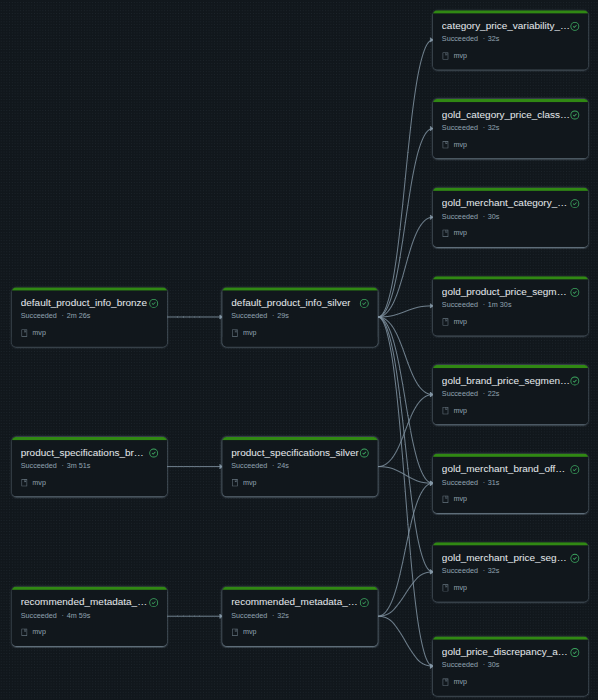

Apresento também as tabelas geradas como resultado da execução.

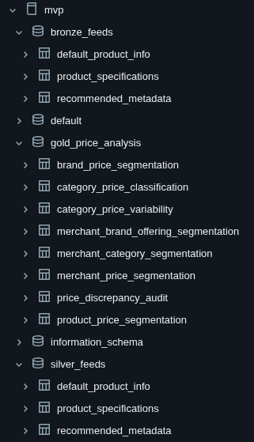

Aqui apresento um diagrama do pipeline explicitando as dependências e quais tasks correspondem a quais camadas



## Documentação das tabelas

Para facilitar, deixei a documentação das tabelas no arquivo [data-dictionary.md](report/datadictionary.md), por se tratar de um arquivo grande, preferi manter separado. Lá é possível encontrar a descrição de tabelas e colunas, valores possíveis de colunas categóricas (para aquelas que tem centenas de valores inclui apenas alguns), intervalos de variação para colunas numéricas e taxas de nulos. Lá podemos observar como algumas colunas na camada Bronze, como `last_updated` estão mal formatadas, contendo links e sendo identificadas como categóricas pela heurística de documentação. Também podemos ver colunas praticamente nulas na camada Bronze como `rrp_price` com 91.82% de nulos.

Esse documento foi gerado pelo notebook [generate-data-dictionary.ipynb](mvp/src/mvp/analysis/generate-data-dictionary.ipynb) que lê as tabelas e gera a documentação em markdown para revisão.


## Respostas às perguntas.

As respostas às perguntas, junto com a análise critica dos resultados está no notebook [questions-answered-report.ipynb](report/questions-answered-report.ipynb) e caso ele não seja carregado corretamente, no HTML [questions-answered-report.html](report/questions-answered-report.html).

Já posso adiantar que, pela análise das respostas, ficou claro a necessidade de mexer na metodologia de cálculo dos segmentos lux, cheap e medium, principalmente para marcas e categorias, embora não tenha me parecido tão problemático para produtos.

A falta de uma categorização padrão também prejudicou bastante, mas as perguntas foram respondidas pelos dados, embora, eu sinta que não tenho a devida confiância nos resultados por causa dos motivos já citados (categoria e segmentação não confiáveis).

Abordarei isso nos meus próximos passos neste trabalho.

## Autoavaliação

A qualidade de dados do feed da AWIN é surpreendentemente ruim. Muitos campos simplesmente não são preenchidos e como consequência, muita informação não é disponibilizada. Campos que deveriam ser padronizados como a categoria de produto segundo a Awin, simplesmente não estão preenchidos, o que nos obriga a depender de conversões sobre dados não padronizados de diferentes vendors. Dados de identificadores globais como códigos de barras oferecem o mesmo problema, além disso, há muita redundância nos dados.

A limpeza dos dados se fez importantíssima, tanto para detectar esses problemas quando para corrigir os dados para o tipo correto. Infelizmente, não foi possível ir muito além com este conjunto de dados, então me limitei a responder questões simples.

Por outro lado, o projeto de entender como lojas se posicionam para clientes com relação aos preços de seus produtos é um desejo antigo meu, pois há anos quero desenvolver um projeto que facilite a busca por produtos online, e parte disso está em encontrar preços adequados ao perfil do cliente, que muitas vezes não dependem apenas de valor, mas do preço relativo ao valor global que o produto tem. Com isso, o desafio de trabalhar com estes dados foi muito interessante, visto que pouco estava disponível mas ainda assim foi possível responder a essas perguntas, claro, com ressalvas.

Agora, sobre essas ressalvas: Uma vez que as categorias não eram confiáveis, já que não temos o mapeamento perfeito da visão de uma certa categoria entre lojas diferentes, fica difícil agrupar os produtos. Pois uma loja especializada em roupas femininas pode categorizar uma certa roupa como cropped enquanto uma loja de roupas de times de futebol categoriza apenas como feminino e uma loja especializa em roupas esportivas pode classificar como roupa para dança ou corrida, essas duas roupas não são comparáveis se olharmos a categoria apenas, mas seriam as mesmas, porém, diante da loja tem especififidade diferente.

Sem o critério fiel de categoria, acabo perdendo o real lastro de comparação, o que torna a roupa um pouco mais abstrato.

Outro problema presente é a dificuldade em definir produtos de luxo/baratos. Assumi que produtos de luxo são aqueles que ocupam os 10% mais caros de uma categoria, enquanto baratos são a maioria, os 50% mais baratos. Essa tecnica falha ao encontrarmos produtos que tem faixas de preço próximoas, o que, por falta de tempo e necessidade, não abordei. Os produtos mais caros de um intervalo de preços que varia entre R$70 e R$100, não podem ser definidos adequadamente como luxo, ao menos não parece adequado, pois um intervalo de R$30 é muito pequeno para efetivamente mudar a percepção do consumidor sobre o luxo certos produtos.

### Próximos passos

Cmo próximos passos eu vou procurar uma forma melhor de definir as categorias entre lojas diferentes, talvez usando palavras chave ou usando machine learning para classificar os produtos à partir dos textos. Outro ponto é definir melhor os segmentos `cheap`, `medium` e `lux`, a análise se mostrou complicada, marcas conhecidas por produtos de luxo estavam sendo vendidas como produtos medium, como `calvil klein`, é importante confirmar se não existe um produto desta marca mais acessível, ou se realmente estamos falando de uma metodologia ruim para agrupar os preços.