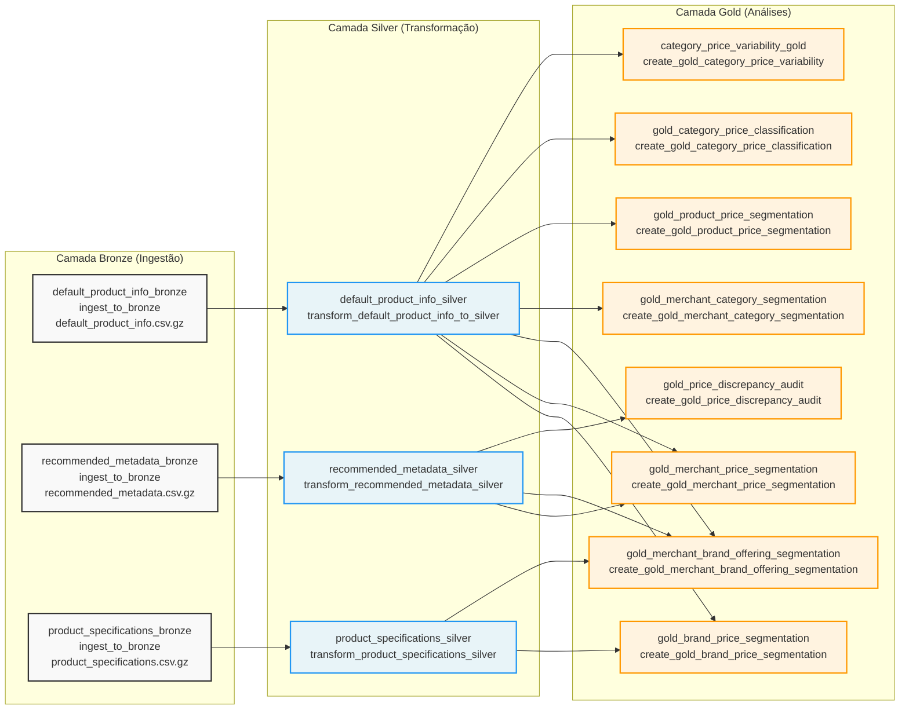

# MVP - Pipeline de Dados Awin

Este projeto implementa um pipeline completo de dados para processamento e análise de dados de produtos da Awin, seguindo a arquitetura Medallion (Bronze-Silver-Gold) no Databricks.

## Arquitetura do Pipeline

O pipeline é organizado em três camadas principais:



## Detalhamento das Tasks

### Camada Bronze - Ingestão de Dados

| Task | EntryPoint | Fonte de Dados | Tabela Destino |
|------|------------|-----------------|----------------|
| `default_product_info_bronze` | `ingest_to_bronze` | `/Volumes/workspace/awin_products/raw_data/awin_feed_data/default_product_info.csv.gz` | `mvp.bronze_feeds.default_product_info` |
| `recommended_metadata_bronze` | `ingest_to_bronze` | `/Volumes/workspace/awin_products/raw_data/awin_feed_data/recommended_metadata.csv.gz` | `mvp.bronze_feeds.recommended_metadata` |
| `product_specifications_bronze` | `ingest_to_bronze` | `/Volumes/workspace/awin_products/raw_data/awin_feed_data/product_specifications.csv.gz` | `mvp.bronze_feeds.product_specifications` |

### Camada Silver - Transformação

| Task | EntryPoint | Tabela Origem | Tabela Destino |
|------|------------|---------------|----------------|
| `default_product_info_silver` | `transform_default_product_info_to_silver` | `default_product_info` | `mvp.silver_feeds.default_product_info` |
| `recommended_metadata_silver` | `transform_recommended_metadata_silver` | `recommended_metadata` | `mvp.silver_feeds.recommended_metadata` |
| `product_specifications_silver` | `transform_product_specifications_silver` | `product_specifications` | `mvp.silver_feeds.product_specifications` |

### Camada Gold - Análises e Segmentações

| Task | EntryPoint | Dependências | Análise Gerada |
|------|------------|--------------|----------------|
| `category_price_variability_gold` | `create_gold_category_price_variability` | `default_product_info_silver` | Variabilidade de preços por categoria |
| `gold_category_price_classification` | `create_gold_category_price_classification` | `default_product_info_silver` | Classificação de preços por categoria |
| `gold_price_discrepancy_audit` | `create_gold_price_discrepancy_audit` | `default_product_info_silver`, `recommended_metadata_silver` | Auditoria de discrepâncias de preços |
| `gold_product_price_segmentation` | `create_gold_product_price_segmentation` | `default_product_info_silver` | Segmentação de preços de produtos |
| `gold_merchant_category_segmentation` | `create_gold_merchant_category_segmentation` | `default_product_info_silver` | Segmentação de merchants por categoria |
| `gold_merchant_brand_offering_segmentation` | `create_gold_merchant_brand_offering_segmentation` | `default_product_info_silver`, `recommended_metadata_silver`, `product_specifications_silver` | Segmentação de offerings por merchant/brand |
| `gold_merchant_price_segmentation` | `create_gold_merchant_price_segmentation` | `default_product_info_silver`, `recommended_metadata_silver` | Segmentação de preços por merchant |
| `gold_brand_price_segmentation` | `create_gold_brand_price_segmentation` | `default_product_info_silver`, `product_specifications_silver` | Segmentação de preços por brand |

## Fluxo de Execução

1. **Ingestão Paralela**: As 3 tasks Bronze executam em paralelo, ingerindo os arquivos CSV compactados do lakehouse
2. **Transformação Sequencial**: Cada tabela Bronze é transformada para sua correspondente Silver
3. **Análises Combinadas**: As tasks Gold utilizam uma ou mais tabelas Silver para gerar insights analíticos
4. **Otimização**: O job está configurado com `max_concurrent_runs: 1` para evitar execuções concorrentes

## Parâmetros Comuns

Todas as tasks utilizam parâmetros padronizados:

- `--catalog`: Catálogo Databricks (`mvp`)
- `--schema`: Schema destino (bronze_feeds, silver_feeds, gold_price_analysis)
- `--table`: Nome da tabela
- `--write-mode`: Modo de escrita (`overwrite`)
- `--metadata-path`: Caminho para metadados das tabelas

## Configurações do Job

- **Timeout**: 3600 segundos (1 hora)
- **Execuções concorrentes**: Máximo 1
- **Notificação em falha**: Email para `ceberiloclaus@gmail.com`
- **Ambiente**: Python wheel package com dependências em `../dist/*.whl`

## Estrutura do Projeto

```
mvp/
├── src/mvp/
│   ├── transformations/     # Scripts de transformação Bronze/Silver/Gold
│   ├── summarization/       # Criação de dashboards e resumos
│   └── shared/             # Funções compartilhadas
├── resources/
│   └── sample_job.job.yml  # Definição do job Databricks
└── tests/                  # Testes unitários
```

## Como Executar

O job pode ser implantado usando o Databricks Asset Bundles:

```bash
databricks bundle deploy
databricks bundle run
```

Ou individualmente através da interface do Databricks Jobs.
